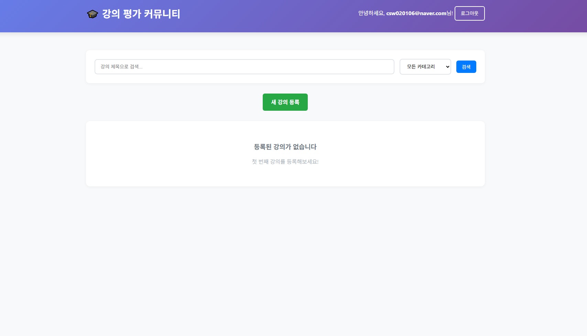
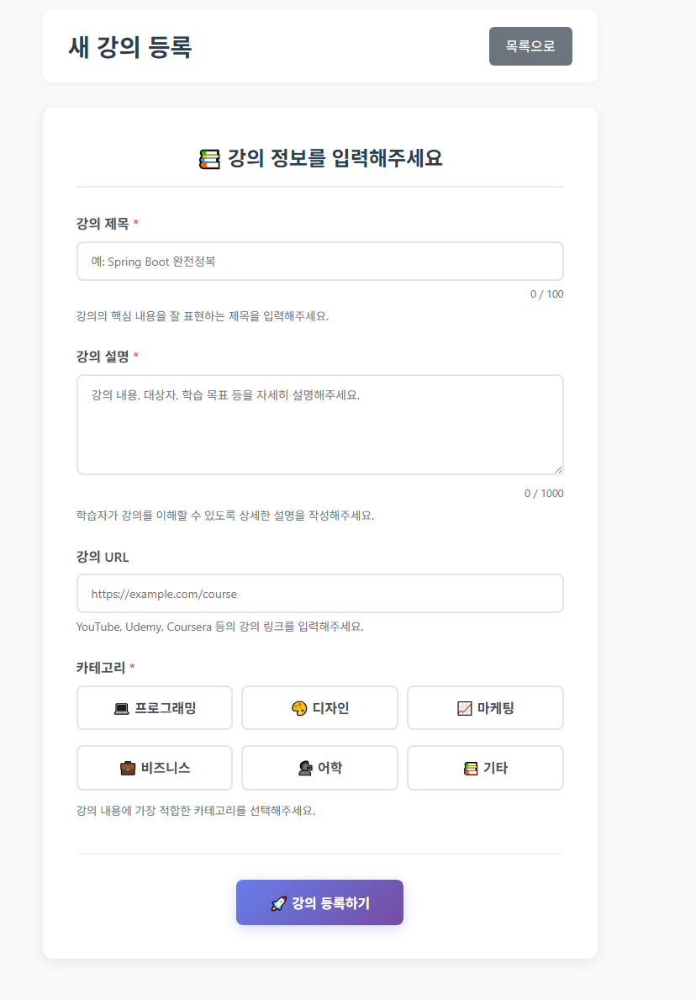
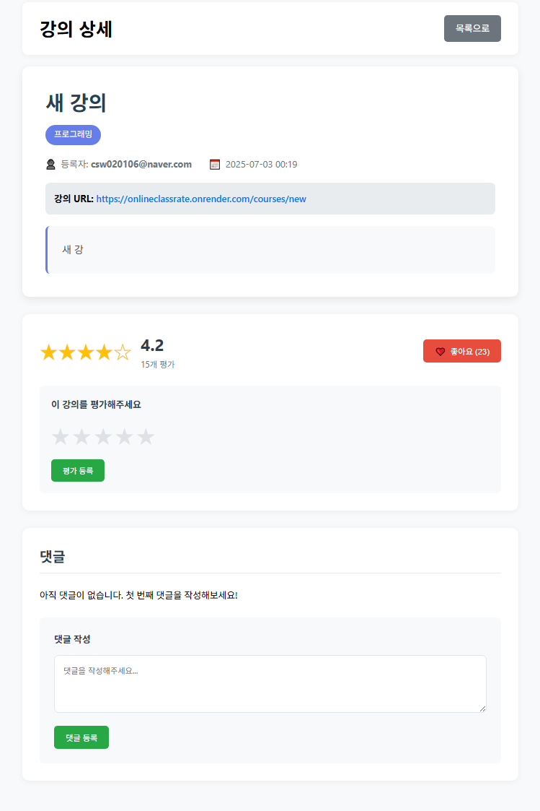

# 온라인 강의 평가 커뮤니티

## 📌 프로젝트 소개

- **이름**: 온라인 강의 평가 커뮤니티


- **설명**: 사용자들이 수강한 온라인 강의를 평가하고, 리뷰를 남기고, 다른 사람의 평점을 확인할 수 있는 웹 애플리케이션입니다.


- **주요 기능**

    1. 강의 목록 조회/검색
    2. 강의별 평점 및 리뷰 작성
    3. 리뷰에 대한 댓글 및 좋아요 기능

## 🖼️ 주요 화면 

|          로그인 페이지           |            회원 가입 페이지            |          메인 페이지           |          새 강의 등록 페이지           |             강의 상세 페이지              |
|:--------------------------:|:-------------------------------:|:-------------------------:|:------------------------------:|:----------------------------------:|
   |   |   |  |   |  

### 로그인페이지

> - 아이디 / 비밀번호 로그인

### 회원가입 페이지

> - 아이디, 비밀번호 입력
> - 약관 동의 체크 가능

### 메인 페이지

> - 전체 강의 목록조회
> - 강의 검색기능
> - 강의별 평점 / 리뷰 요약 표시

### 새강의 등록 페이지

> - 강의명, 설명, 카테고리 등 정보 입력
> - 강의 등록

### 강의 상세 페이지

> - 강의 설명, 리뷰, 평점 조회

## 🛠️ 기술 스택
- **언어**: Java 17
- **프레임워크**: Spring Boot 3.5.3 (Spring MVC, Spring Data JPA, Spring validation)
- **템플릿 엔진**: Thymeleaf
- **빌드 도구**: Maven
- **데이터베이스**:  Java (개발), PostgreSQL (운영)

---

## Data Schema

- **DB 종류** : PostgreSQL

### 📂 DB 연동 방법별 코드 위치

- JPA(PostgreSQL,h2)용 Repository 구현체:

  `src/main/java/com/example/online_community/repository/jpa/`


- 메모리 개발용 Repository 구현체:

  `src/main/java/com/example/online_community/repository/memory/`

### PostgreSQL, H2 Database 연동방법 

`properties/` : 해당 폴더위치에 방법이 나와있습니다. 참고부탁드립니다!

### 주요 테이블 설명

| 테이블명          | 설명                                  |
|------------------|-------------------------------------|
| users            | 회원 정보 저장                        |
| courses          | 강의(온라인 강좌) 정보 저장            |
| comments         | 강의별 댓글/리뷰 정보 저장             |
| course_ratings   | 강의 평점(1~5점), 유저별 1회 제한      |
| likes            | 강의 좋아요(조인 테이블)               |

- **ERD 다이어 그램** : 


- **주요 테이블 DDL**

```sql
-- 2) users 테이블 : 회원 정보 저장 

CREATE TABLE IF NOT EXISTS users (
    id          BIGSERIAL PRIMARY KEY,
    username    VARCHAR(255) NOT NULL UNIQUE,
    password    VARCHAR(255) NOT NULL,
    created_at  TIMESTAMP    NOT NULL DEFAULT CURRENT_TIMESTAMP
);

-- 3) courses 테이블 : 강의(온라인 강좌) 정보 저장

CREATE TABLE IF NOT EXISTS courses (
    id          BIGSERIAL PRIMARY KEY,
    title       VARCHAR(255) NOT NULL,
    description TEXT,
    url         VARCHAR(500),
    category    VARCHAR(100),
    author_id   BIGINT REFERENCES users(id)
                   ON DELETE SET NULL
                   ON UPDATE CASCADE,
    created_at  TIMESTAMP NOT NULL DEFAULT CURRENT_TIMESTAMP
);

-- 4) comments 테이블 : 강의별 댓글 / 리뷰 저장

CREATE TABLE IF NOT EXISTS comments (
    id          BIGSERIAL PRIMARY KEY,
    content     TEXT      NOT NULL,
    user_id     BIGINT    NOT NULL REFERENCES users(id)
                   ON DELETE CASCADE
                   ON UPDATE CASCADE,
    course_id   BIGINT    NOT NULL REFERENCES courses(id)
                   ON DELETE CASCADE
                   ON UPDATE CASCADE,
    created_at  TIMESTAMP NOT NULL DEFAULT CURRENT_TIMESTAMP
);

-- 5) course_ratings 테이블 : 강의 평점 (1 ~ 5점) 저장

CREATE TABLE IF NOT EXISTS course_ratings (
    id          BIGSERIAL PRIMARY KEY,
    score       INTEGER   NOT NULL CHECK (score >= 1 AND score <= 5),
    user_id     BIGINT    NOT NULL REFERENCES users(id)
                   ON DELETE CASCADE
                   ON UPDATE CASCADE,
    course_id   BIGINT    NOT NULL REFERENCES courses(id)
                   ON DELETE CASCADE
                   ON UPDATE CASCADE,
    created_at  TIMESTAMP NOT NULL DEFAULT CURRENT_TIMESTAMP,
    UNIQUE (user_id, course_id)
);

-- 6) likes (순수 조인테이블) : 강의 좋아요 (조인 테이블)

CREATE TABLE IF NOT EXISTS likes (
    course_id   BIGINT NOT NULL REFERENCES courses(id)
                   ON DELETE CASCADE
                   ON UPDATE CASCADE,
    user_id     BIGINT NOT NULL REFERENCES users(id)
                   ON DELETE CASCADE
                   ON UPDATE CASCADE,
    PRIMARY KEY (course_id, user_id)
);
```